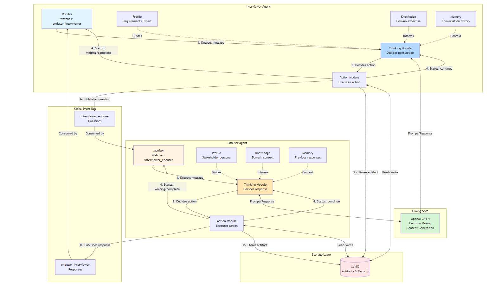

# iReDev: Knowledge-Driven Multi-Agent Requirements Development System

## 🎯 Project Goal

This project implements an intelligent requirements elicitation system based on the iReDev framework (Knowledge-Driven Multi-Agent Framework for Intelligent Requirements Development). The system automates the software requirements gathering process through AI-powered agent conversations, reducing the time and effort needed for requirements engineering while maintaining high-quality outputs.

## 💡 What Problem Does It Solve?

Traditional requirements development is:
- **Time-consuming**: Requires hours of manual interviews and documentation
- **Labor-intensive**: Needs experienced requirements engineers
- **Error-prone**: Human biases and inconsistencies
- **Costly**: Multiple stakeholder meetings and iterations

Our system automates this process using intelligent agents that simulate real stakeholder interactions and produce structured requirements documents.

## 🚀 How It Works



*Figure: Multi-agent interaction flow showing Interviewer and Enduser agents communicating through Kafka event bus. The Interviewer Agent asks questions, the Enduser Agent responds, and all interactions are stored in MinIO for persistence.*

## ✨ Key Features

- **Fully Automated**: No manual intervention needed after initial input
- **Intelligent Conversations**: Agents follow proven requirements elicitation best practices
- **Saturation Detection**: Automatically stops when conversation becomes repetitive (>0.8 score)
- **Structured Output**: Generates professional requirements documents in plain text format
- **Event-Driven**: Agents communicate asynchronously via Kafka
- **Persistent Storage**: All artifacts saved in MinIO for review and audit
- **Turn-Based Logic**: Smart decision making based on conversation progress

## 📊 What You Get

After running the system, you receive:

1. **Interview Record** (`interview-records/interview_session_*.txt`)
   - Complete conversation transcript
   - Timestamped Q&A exchanges
   - Plain text format for easy review

2. **User Requirements List** (`requirements-artifacts/user_requirements_*.txt`)
   - Structured list of all requirements
   - Priority levels (High/Medium/Low)
   - Source tracking (who mentioned what)
   - Functional/Non-functional categorization

## 🏗️ Technology Stack

- **LLM**: OpenAI GPT-4o or GPT-5 series for intelligent decision making
- **Message Queue**: Apache Kafka for agent communication
- **Storage**: MinIO for artifact persistence
- **Language**: Python 3.8+
- **Framework**: Event-driven multi-agent architecture

## 📦 Quick Start

### Prerequisites
- Docker & Docker Compose
- Python 3.8+
- OpenAI API Key

### Installation

```bash

# 1. Install Python dependencies
pip install -r requirements.txt

# 2. Start services (Kafka + MinIO)
docker-compose up -d

# 3. Run the system
python main.py
```

### Verify Services

```bash
# Check Kafka is running
curl http://localhost:9092

# Check MinIO is running (Web UI)
open http://localhost:9090
# Login: admin / password
```

## 🗂️ Output Files

All artifacts are saved in MinIO:

```
MinIO/
├── interview-records/
│   └── interview_session_001_record.txt
│       [2025-01-01T10:00:00Z] Interviewer: What features do you need?
│       [2025-01-01T10:01:23Z] Enduser: I need task creation...
│
└── requirements-artifacts/
    └── user_requirements_abc123.txt
        USER REQUIREMENTS LIST
        Generated: 2025-01-01T10:30:00Z
        ...
```

Access via MinIO Web UI: http://localhost:9001

## 🎓 Based on Research

This implementation follows the **iReDev framework** published in:

> Dongming Jin et al. "iReDev: A Knowledge-Driven Multi-Agent Framework for Intelligent Requirements Development." 
> ACM Transactions on Software Engineering and Methodology, 2025.

## 🔒 Security Notes
- Store OpenAI API key in `.env` file (not in code)